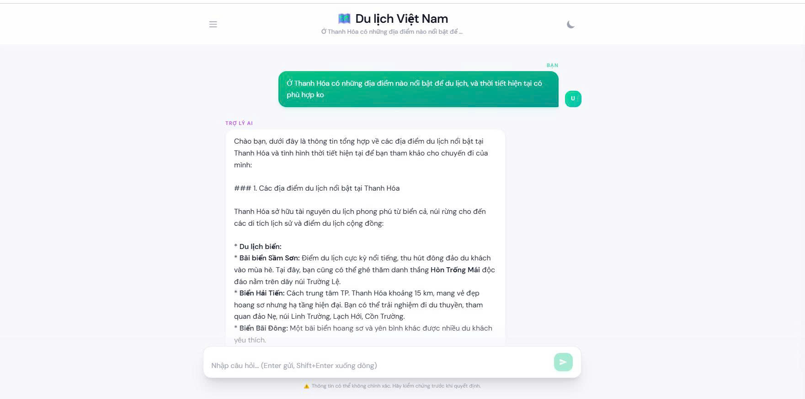
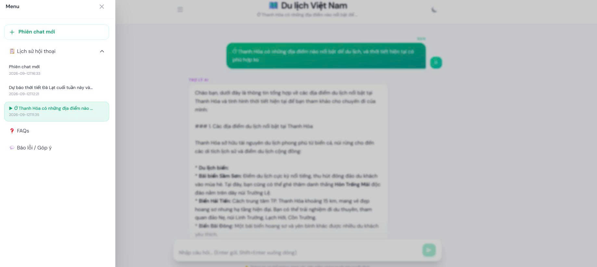
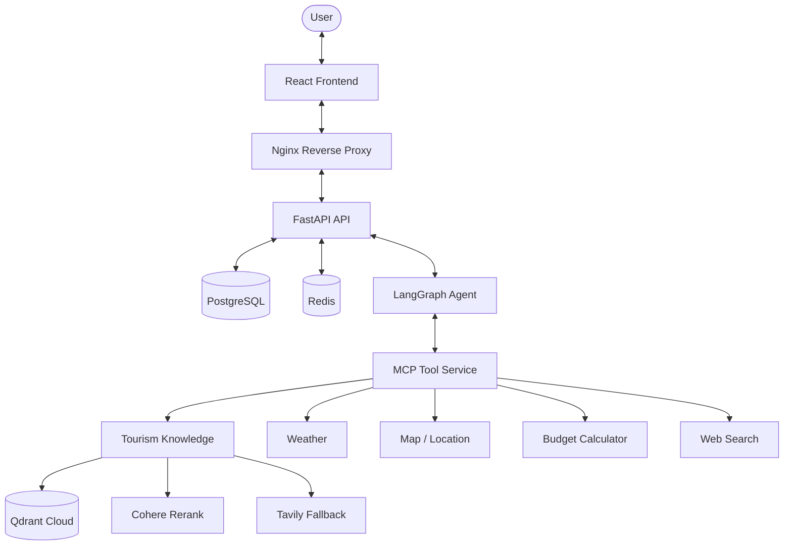
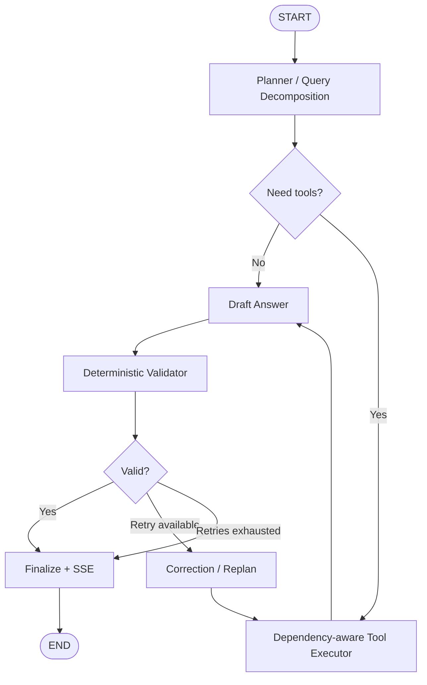

<h1 align="center">Agentic RAG Tourism Assistant (Vietnam)</h1>

<div align="center">


</div>
** An End-to-End Agentic AI system engineered to decompose and resolve complex, compound travel queries in Vietnam. Built with LangGraph for agent orchestration, Model Context Protocol (MCP) for tool serving, and a robust hybrid search + web fallback retrieval pipeline. **

---

## 📷 Demo

### Live Demo
**http://18.141.125.164/**

### Chat Interface
<div align="left">
  
</div>
<div align="left">
  
</div>

---

## 🏗️ Architecture Overview

The system separates web delivery, agent orchestration, tool execution, retrieval, and persistence.



### Agentic Workflow



The planner returns structured goals, subtasks, tool calls, arguments, and dependencies. The executor treats the tool plan as a small DAG, while the validator checks tool completeness before the final answer is streamed.

---

## 🌟 Core AI Engineering Features

### 1. LangGraph Planning & Query Decomposition

The agent decides whether to answer directly or call one or more tools.

Example:

```text
User:
"Plan a 3-day Da Nang trip next week and tell me if 5 million VND is enough."

Possible plan:
1. Retrieve tourism recommendations
2. Check weather
3. Calculate budget
4. Synthesize final response
```

The workflow is bounded to avoid uncontrolled retries.

### 2. Model Context Protocol (MCP)

Tools are exposed through a dedicated MCP service using Streamable HTTP.

| Tool | Purpose | Provider |
|---|---|---|
| `search_tourism_knowledge` | Tourism RAG retrieval | Qdrant + Cohere + Tavily |
| `weather` | Weather / forecast | OpenWeatherMap |
| `map_location` | Place search / details | Goong |
| `budget_calculator` | Travel budget calculation | Local deterministic tool |
| `web_search` | Fresh/current information | Tavily |

The API discovers tool schemas through MCP instead of tightly coupling every provider to the planner.

### 3. Hybrid Retrieval + Adaptive Web Fallback

```text
Query
  |
Qdrant Dense + Sparse Retrieval
  |
RRF Fusion
  |
Cohere Rerank
  |
  +--> Strong internal evidence --> Return result
  |
  `--> Low score / fresh query --> Tavily fallback
```

Key behaviors:

- dense + sparse hybrid retrieval;
- RRF ranking;
- Cohere reranking;
- fallback to Qdrant ranking if reranking is unavailable;
- web fallback for low-confidence or freshness-sensitive queries.

```env
ADAPTIVE_RETRIEVAL_THRESHOLD=0.3
```

### 4. Validator & Bounded Self-Correction

A deterministic validator checks that planned steps have observations, successful tools return non-empty results, and the draft answer is valid.

If validation fails, the planner can repair arguments, dependencies, or tool choices.

```env
AGENT_MAX_RETRIES=1
```

### 5. Evaluation & Observability

Evaluation covers:

- Recall@K and MRR;
- tool Precision / Recall / F1;
- Faithfulness;
- Relevance.

Langfuse can trace planner calls, tool execution, retrieval, validation, self-correction, and final generation.

---

## 🛠️ Tech Stack & State Design

### Technical Stack

| Layer | Technologies | Key Role |
| :--- | :--- | :--- |
| **Frontend** | React | Chat UI and streamed responses |
| **Web/API Layer** | FastAPI, SSE | Sessions, chat API, token streaming |
| **Agent Orchestration** | LangGraph | Planning, routing, validation, retries |
| **LLM** | Google Gemini | Structured planning and response generation |
| **Tool Platform** | MCP Streamable HTTP | Tool discovery and execution |
| **Vector DB** | Qdrant Cloud | Tourism knowledge retrieval |
| **Retrieval** | Dense + Sparse, RRF | Hybrid candidate retrieval |
| **Reranking** | Cohere Rerank | Query-document reranking |
| **External Tools** | OpenWeatherMap, Goong, Tavily | Weather, maps, fresh web data |
| **Persistence** | PostgreSQL | Durable sessions/messages |
| **Memory / Cache** | Redis | Short-term memory, cache, rate limiting |
| **Migration** | Alembic | Versioned DB schema migration |
| **Observability** | Langfuse, structured logs | Tracing and latency monitoring |
| **DevOps** | Docker, Nginx, GitHub Actions, AWS EC2 | Packaging, proxying, CI/CD, deployment |

### Simplified Agent State

```python
class AgentState(TypedDict, total=False):
    user_query: str
    session_id: str
    conversation_history: list
    goal: str
    subtasks: list[str]
    tool_calls: list[dict]
    tool_observations: list[dict]
    draft_answer: str
    validation_issues: list[str]
    retry_count: int
    final_answer: str
```

---

## 📁 Folder Structure

```text
Agentic-Tourism-AI-Assistant/
├── tourism_agent/              # Agent, tools, MCP, retrieval, evaluation
├── frontend/                   # React frontend
├── evaluation/                 # Evaluation dataset
├── alembic/                    # PostgreSQL migrations
├── deploy/
│   └── nginx/                  # Reverse proxy config
├── scripts/
│   └── deploy-production.sh
├── .github/
│   └── workflows/              # CI/CD workflows
├── Dockerfile
├── compose.yaml
├── compose.production.yaml
└── .env.example
```

---

## ⚡ Getting Started

### Prerequisites

- Docker & Docker Compose
- Node.js / npm
- API keys for enabled providers

### 1. Clone

```bash
git clone https://github.com/acesmile123/Agentic-Tourism-AI-Assistant.git
cd Agentic-Tourism-AI-Assistant
```

### 2. Configure environment

```bash
cp .env.example .env
```

```env
GEMINI_API_KEY=
QDRANT_URL=
QDRANT_API_KEY=
COLLECTION_NAME=
EMBED_MODEL=
COHERE_API_KEY=
OPENWEATHER_API_KEY=
GOONG_API_KEY=
TAVILY_API_KEY=
DATABASE_URL=
REDIS_MEMORY_URL=
REDIS_CACHE_URL=
REDIS_RATE_LIMIT_URL=
MCP_SERVER_URL=http://mcp:8001/mcp
ADAPTIVE_RETRIEVAL_THRESHOLD=0.3
AGENT_MAX_RETRIES=1
```

Do not commit real secrets.

### 3. Start services

```bash
docker compose up -d --build
docker compose ps
```

```bash
docker compose logs -f mcp api
```

### 4. Start frontend

```bash
cd frontend
npm ci
npm run dev
```

```text
API:      http://localhost:8000
API Docs: http://localhost:8000/docs
MCP:      http://localhost:8001/mcp
```

---

## 🧪 Testing & Evaluation

Run tests:

```bash
pytest -q
```

Quick evaluation:

```bash
python -m tourism_agent.evaluation.runner \
  --transport mcp \
  --limit 2 \
  --no-llm-judge
```

Full evaluation:

```bash
python -m tourism_agent.evaluation.runner --transport mcp
```

Evaluation reports can be compared against an approved baseline to detect regressions.

---

## ☁️ Deployment

### Current Public Demo

```text
Internet
   |
AWS EC2
   |
Docker Compose
   |
   +-- Nginx
   +-- React
   +-- FastAPI
   +-- MCP
   +-- PostgreSQL
   `-- Redis
```

### Target Production Architecture

```text
EC2 Application Services
   |
   +-- RDS PostgreSQL
   +-- ElastiCache Redis
   +-- Qdrant Cloud
   `-- External AI / Tool APIs
```

| Mode | Status |
|---|---|
| **Current public demo** | EC2 + Docker containers for app, PostgreSQL, Redis, MCP, Web, and Nginx |
| **Target production** | EC2 app services + RDS PostgreSQL + ElastiCache Redis |

RDS and ElastiCache are target managed services, not claimed as part of the current public demo.

---

## 🚀 CI/CD & Production Hardening

GitHub Actions workflows are included for automated testing, Docker image build/publishing, and image-based deployment.

Typical flow:

```text
git push
   |
GitHub Actions
   |
test -> build -> publish
   |
SSH to EC2
   |
pull image -> Alembic migration -> Compose update
```

Production-related controls include Nginx reverse proxy, SSE buffering disabled for `/api/chat`, Redis-backed rate limiting, structured logs, Alembic migrations, non-public internal ports, and secrets excluded from Git.

**HTTPS is planned after a domain and Docker-compatible certificate automation are configured.**

---

## 📚 Development Phases

```text
Phase 1 — Modular production foundation
Phase 2 — LangGraph agent + dynamic tool selection
Phase 3 — MCP tool platform + adaptive retrieval
Phase 4 — Agent reliability + bounded self-correction
Phase 5 — Evaluation + Langfuse observability
Phase 6 — AWS deployment + production hardening
```

---

## 📄 License

Released under the [MIT License](LICENSE).
